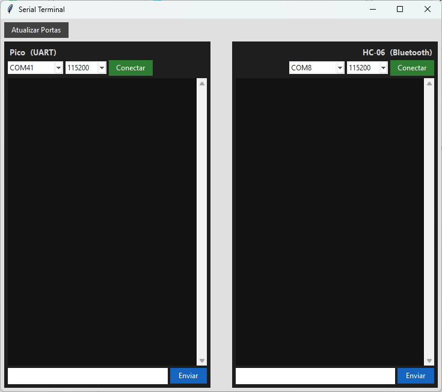

# HC-06 Exemplo

Sistema de inicialização e configuração do módulo **HC-06** em uma **Raspberry Pi Pico 2** com **FreeRTOS**.

Manual: https://www.olimex.com/Products/Components/RF/BLUETOOTH-SERIAL-HC-06/resources/hc06.pdf


## Conexões

### HC-06 → Pico

| HC-06         | Pico        |
|---------------|-------------|
| STATE         | GP3         |
| RXD (3.3V In) | GP4 (TX1)   |
| TXD (3.3V Out)| GP5 (RX1)   |
| ENABLE        | GP6         |
| GND           | GND         |
| VCC           | VBUS (5V)   |

```
  +---------------+                      +---------------+
  |     HC-06     |                      |    RPi Pico   |
  +---------------+                      +---------------+
  |         STATE |  ----------------->  | GP3           |
  | (3.3V In) RXD |  <-----------------  | GP4 (TX1)     |
  | (3.3V Out)TXD |  ----------------->  | GP5 (RX1)     |
  |        ENABLE |  <-----------------  | GP6           |
  |           GND |  ----------------->  | GND           |
  |           VCC |  <-----------------  | VBUS (5V)     |
  +---------------+                      +---------------+
```


## Diagrama

### O que é e como funciona xTaskNotify

[xTaskNotify](https://www.freertos.org/Documentation/02-Kernel/04-API-references/05-Direct-to-task-notifications/04-xTaskNotify) é uma função da FreeRTOS usada para enviar notificações ou pequenos sinais diretamente entre tarefas (tasks) ou de uma rotina de interrupção (ISR) para uma task. O mecanismo é leve e eficiente, permitindo que uma task seja avisada rapidamente sobre eventos ou dados disponíveis, sem a necessidade de utilizar filas ou semáforos para casos simples.

No funcionamento típico, uma ISR (por exemplo, de UART) chama `xTaskNotify` (ou variantes como `vTaskNotifyGiveFromISR`) para alertar uma task de que há trabalho a ser feito. A task pode então esperar por essa notificação usando funções como `ulTaskNotifyTake`, processando apenas quando realmente necessário. Isso reduz o tempo gasto em interrupções e mantém o sistema mais responsivo.

**Resumo:**
- Notificações são leves e rápidas.
- Ideal para sinalizar eventos simples de ISR para tarefas.
- A task pode “dormir” até receber a notificação, acordando apenas quando houver necessidade de atendimento ao evento.

#### Diagrama do funcionamento

```
            +-----------+
            |init_task  |
            +-----+-----+
                  |
                  v
         (faz a inicialização: UART, HC-06 etc, e termina)
              
   (UART_IRQ)
       o
       | xTaskNotify
       v
+---------+   xQueueRX    +-------------+         xQueueTX    +---------+
| rx_task | <------------ | serial_task | ------------------> | tx_task |
+---------+               +-------------+                     +---------+
```

- **init_task**: Responsável pela configuração inicial do hardware, UART, módulo HC-06 e interrupções. Executa uma única vez no início do sistema.
- **rx_task**: É notificada pela interrupção, lê da UART e insere bytes na fila xQueueRX.
- **serial_task**: Faz a ponte entre o PC (via USB/serial), lê xQueueRX e mostra no PC; lê input do PC e coloca na xQueueTX.
- **tx_task**: Lê bytes da xQueueTX e envia via UART ao Bluetooth.


## Como configurar o nome e PIN do Bluetooth

No `main.c`, o nome e o PIN do módulo Bluetooth são definidos por macros:

```c
#define HC06_NAME "LAB-EXPERT-BT"
#define HC06_PIN  "1234"
```
Para utilizar outro nome ou PIN, basta alterar esses valores no início do arquivo `main.c` antes de compilar o projeto.

## Testando a Comunicação Serial com Python

Para validar, monitorar ou interagir com o HC-06 a partir do seu PC, existe um programa Python simples chamado `terminal.py` incluso na pasta `python` do repositório.




### Funcionamento geral

O arquivo `terminal.py`, localizado na pasta `python`, permite abrir um terminal de comunicação simples, onde você deve selecionar ambas as portas COM utilizadas pelo Raspberry Pi Pico (normalmente uma para a UART do Bluetooth e outra para o console/USB).

- O script utiliza a biblioteca `pyserial` para abrir as portas seriais conectadas ao Raspberry Pi Pico.
- Durante a execução, você escolhe as duas portas seriais desejadas (ex: `COM3` para o console e `COM4` para o Bluetooth, ou `/dev/ttyACM0` e `/dev/ttyACM1`).
- Tudo o que for digitado pode ser enviado para o módulo HC-06, e as respostas do Bluetooth serão mostradas no terminal.
- O programa facilita testes tanto do controle Bluetooth quanto do monitoramento da porta de depuração do Pico.

### Como usar
1. Instale a dependência Python caso necessário:
   ```
   pip install pyserial
   ```
2. Execute o script, por exemplo:
   ```
   python serial_terminal.py
   ```
3. Siga os prompts para abrir a porta correta e use normalmente.

## No Linux

Para testar a comunicação Bluetooth no Linux, siga a configuração do HC-06 usada em aula e faça o pareamento normalmente pelo gerenciador de Bluetooth do sistema.
